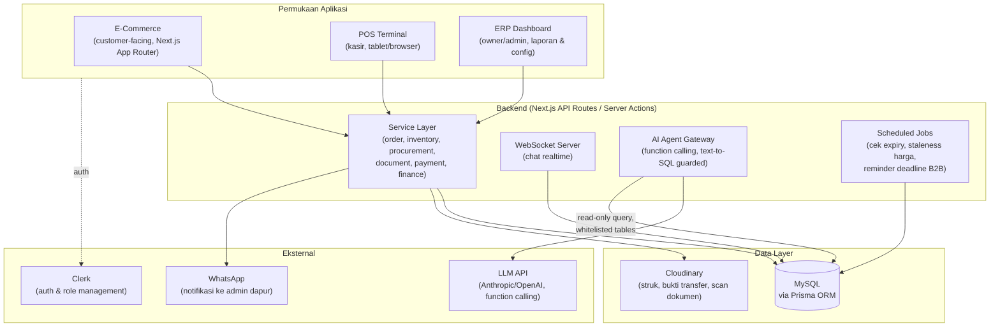
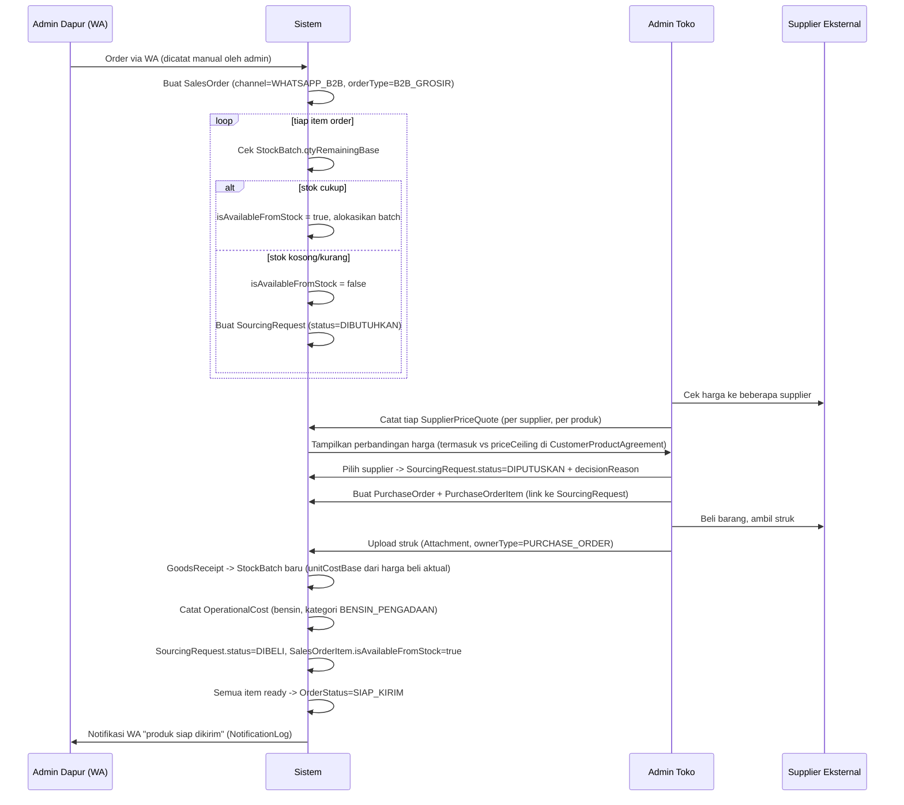
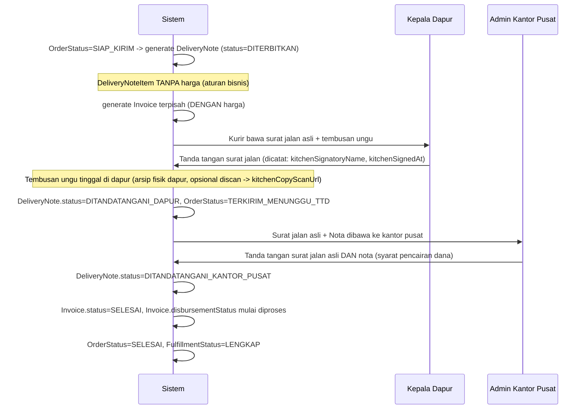
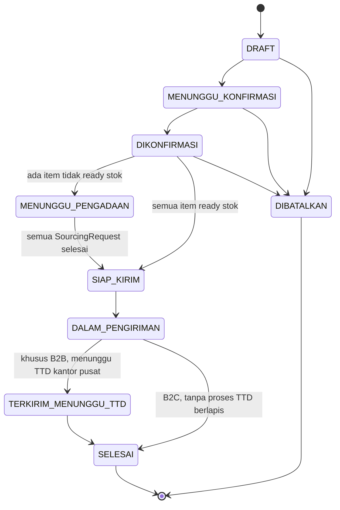
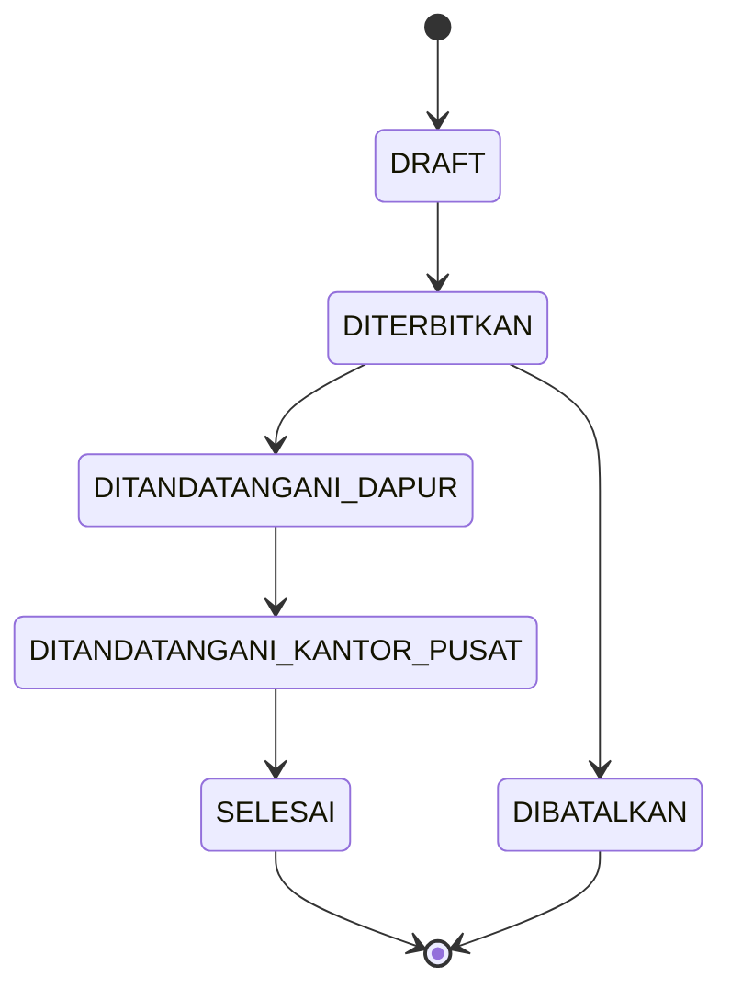
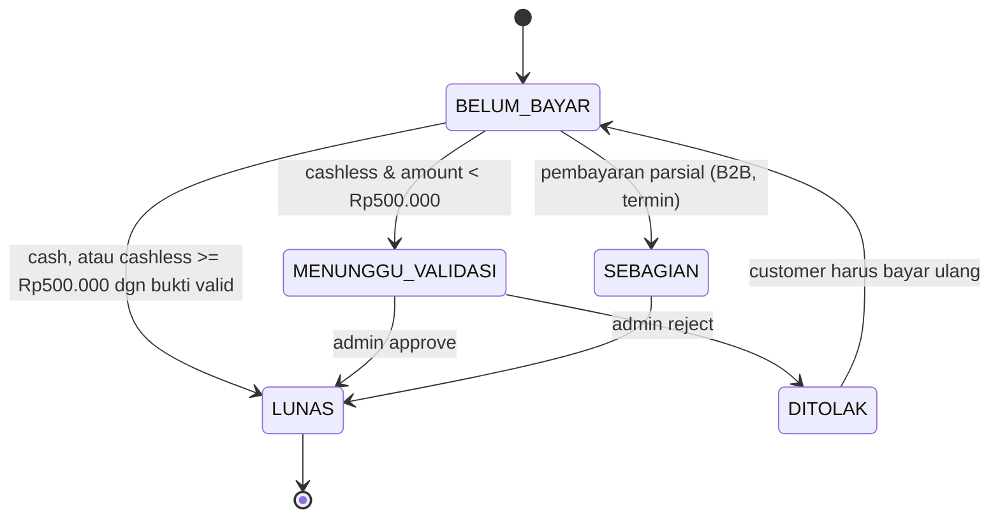
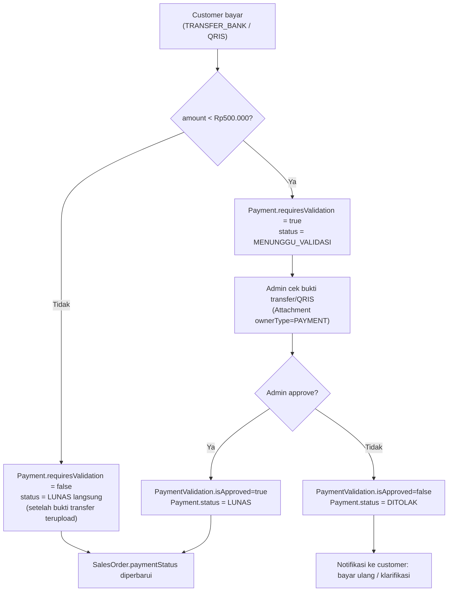

# Sistem ERP + POS + E-Commerce Hybrid — Toko Sembako (B2C & B2B/SPPG MBG)

> **Dokumen ini adalah context & schema pack lengkap.** Ditulis agar developer atau AI coding agent (Claude Code, Cursor, dsb.) bisa langsung mulai implementasi tanpa perlu klarifikasi ulang soal domain bisnis. Skema database di Bagian 5 **sudah divalidasi secara struktural** (39 model, 15 enum, seluruh relasi dua arah konsisten) menggunakan Prisma schema parser.
>
> File pendamping: **`schema.prisma`** (siap `prisma migrate dev`, satu isi persis dengan Bagian 5).

---

## Daftar Isi

1. [Ringkasan Bisnis](#1-ringkasan-bisnis)
2. [Arsitektur Sistem](#2-arsitektur-sistem)
3. [Aktor & Role](#3-aktor--role)
4. [Prinsip Desain Skema](#4-prinsip-desain-skema)
5. [Skema Database (Prisma, MySQL)](#5-skema-database-prisma-mysql)
6. [Alur Bisnis Kritis](#6-alur-bisnis-kritis)
7. [State Machine](#7-state-machine)
8. [Registry Aturan Bisnis (Config, Bukan Hardcode)](#8-registry-aturan-bisnis-config-bukan-hardcode)
9. [Logika Perhitungan Margin & HPP (Batch Costing)](#9-logika-perhitungan-margin--hpp-batch-costing)
10. [Dokumen: Surat Jalan & Nota](#10-dokumen-surat-jalan--nota)
11. [Pembayaran Cashless & Validasi Admin](#11-pembayaran-cashless--validasi-admin)
12. [Modul E-Commerce (B2C)](#12-modul-e-commerce-b2c)
13. [Modul POS (Offline/Walk-in)](#13-modul-pos-offlinewalk-in)
14. [Modul ERP / Keuangan](#14-modul-erp--keuangan)
15. [Audit & Kesiapan Sidak BGN Pusat](#15-audit--kesiapan-sidak-bgn-pusat)
16. [AI Agentic Features (Function Calling + Text-to-SQL)](#16-ai-agentic-features-function-calling--text-to-sql)
17. [Rekomendasi Arsitektur Teknis](#17-rekomendasi-arsitektur-teknis)
18. [Indexing, Performance & Security Checklist](#18-indexing-performance--security-checklist)
19. [Roadmap Implementasi Bertahap](#19-roadmap-implementasi-bertahap)
20. [Seed Data Awal](#20-seed-data-awal)
21. [Lampiran: Walkthrough Kasus Nyata (Cimory 125rb/karton)](#21-lampiran-walkthrough-kasus-nyata-cimory-125ribukarton)

---

## 1. Ringkasan Bisnis

Bisnis toko sembako dengan dua jalur penjualan yang **berbeda karakteristik tapi harus hidup dalam satu sistem**:

| | B2C (Ecer) | B2B (Grosir — SPPG MBG & event) |
|---|---|---|
| Pembeli | Individu sekitar Mojokerto | Dapur SPPG (via WA), diawasi kantor pusat SPPG |
| Satuan & harga | Ecer, harga tetap per katalog | Grosir, ada **pagu harga maksimal** per produk per institusi |
| Stok | Biasanya tersedia dari gudang | Sering butuh **pengadaan dadakan** dari supplier eksternal saat stok kosong |
| Pengiriman | Gratis dalam radius Mojokerto | Dikirim ke dapur, butuh **dokumen resmi** |
| Dokumen | Nota sederhana | **Surat jalan rangkap 2 (tanpa harga) + nota terpisah (dengan harga)**, masing-masing butuh tanda tangan berlapis |
| Pembayaran | Cash/QRIS di tempat, atau checkout online | Transfer/QRIS ke rekening, **butuh pencairan dana lewat kantor pusat** setelah dokumen lengkap ditandatangani |
| Auditabilitas | Standar | **Tinggi** — sewaktu-waktu diperiksa auditor BGN pusat, semua bukti harus lengkap & tertelusur |

**Masalah inti yang harus diselesaikan sistem:**

1. Stok real-time + **kadaluwarsa per batch**, karena produk sembako (susu, dsb.) punya expiry date.
2. Perbandingan harga supplier yang **sangat dinamis** (Indomaret promo, Indogrosir, Lotte Grosir, dst.) — dicatat, dibandingkan, dan dipilih secara terstruktur, bukan di kepala/WA saja.
3. **Margin per transaksi** dihitung presisi: harga beli aktual (bisa beda-beda per sumber) − ongkos operasional (bensin ambil/kirim) → margin bersih.
4. Alur dokumen fisik (surat jalan asli vs tembusan ungu, nota terpisah, tanda tangan berlapis) direpresentasikan digital tapi **tetap sinkron dengan proses fisik** yang sudah berjalan.
5. Tracking piutang: mana order yang **sudah kirim tapi belum dibayar**, dan sebaliknya (sudah bayar tapi belum kirim) — makanya `paymentStatus` dan `fulfillmentStatus` dipisah, tidak digabung jadi satu status.
6. Validasi pembayaran cashless untuk nominal kecil (< Rp500.000) — butuh langkah approval admin manual sebelum dianggap lunas.
7. Bukti fisik (struk belanja, bukti transfer, scan surat jalan) harus **ter-upload, ter-inventaris, dan bisa ditarik ulang** kapan saja untuk kebutuhan audit.
8. Digitalisasi penuh: e-commerce (B2C online), POS (walk-in), dan ERP (hulu-hilir: modal, arus kas, neraca, laba rugi) — **satu database, tiga permukaan (surface)**.

---

## 2. Arsitektur Sistem



**Prinsip kunci:** satu backend service layer, satu database. E-commerce, POS, dan ERP bukan tiga aplikasi terpisah — mereka adalah tiga *front* yang memanggil service layer yang sama (mis. `createSalesOrder()` dipakai baik oleh checkout e-commerce maupun input kasir POS, hanya beda `channel`).

---

## 3. Aktor & Role

| Role (`UserRole`) | Deskripsi | Akses utama |
|---|---|---|
| `OWNER` | Ibu — pemilik bisnis | Semua modul, termasuk laporan keuangan & approval besar |
| `ADMIN_TOKO` | Admin harian | Order, procurement, dokumen, validasi pembayaran |
| `STAFF_GUDANG` | Petugas gudang | Input stok masuk/keluar, catat batch & expiry |
| `KASIR` | Kasir POS | Transaksi walk-in, cetak nota |
| `KURIR` | Pengantar | Update status pengiriman, upload foto bukti serah terima |
| `SUPER_ADMIN` | Developer/maintenance | Akses penuh termasuk config sistem |

Pihak eksternal (bukan `User` sistem, tapi tercatat via `InstitutionContact`):
- **Admin Dapur** — pemesan via WA, kontak utama transaksi harian.
- **Kepala Dapur** — penandatangan surat jalan (tembusan ungu yang dia pegang).
- **Admin Kantor Pusat SPPG** — penandatangan surat jalan asli **dan** nota, syarat pencairan dana.

---

## 4. Prinsip Desain Skema

Beberapa keputusan desain yang **disengaja** dan perlu dipahami sebelum membaca skema mentah:

1. **`SalesOrder` disatukan untuk B2C dan B2B** (dibedakan lewat `orderType` dan `channel`), bukan dua tabel terpisah. Ini supaya laporan penjualan, margin, dan stok tidak perlu union dua tabel berbeda struktur.
2. **Harga jual & HPP di-snapshot per `SalesOrderItem`** (`unitSellPrice`, `unitCostPrice`) — bukan hanya referensi ke tabel harga. Alasan: harga supplier berubah tiap minggu, kalau tidak di-snapshot, margin transaksi lama akan salah dihitung ulang saat harga sumber berubah.
3. **`StockBatch` adalah sumber kebenaran stok riil** (`qtyRemainingBase`), sedangkan `StockMovement` adalah **ledger audit** (immutable, append-only) untuk semua pergerakan. Saldo stok = `SUM(StockBatch.qtyRemainingBase)`, bukan dihitung ulang dari seluruh histori movement setiap kali (lebih cepat, tetap auditable lewat `StockMovement`).
4. **`SourcingRequest`** adalah entitas eksplisit untuk kasus "barang di order B2B tidak ready → harus dicari di supplier lain". Ini yang menangkap proses "bandingkan harga, catat alasan pilih toko mana" secara terstruktur, bukan cuma catatan bebas.
5. **`SupplierPriceQuote`** adalah time-series log harga (bukan satu kolom "harga sekarang" yang ditimpa terus) — supaya histori harga supplier tetap bisa dianalisis AI agent ("kapan Indogrosir biasanya lebih murah dari Lotte Grosir untuk produk X?").
6. **`DeliveryNote` satu baris per order**, merepresentasikan satu dokumen fisik yang punya dua tanda tangan pada dua "lapis" (kepala dapur & kantor pusat), bukan dua baris terpisah — karena secara bisnis itu **satu dokumen** yang berjalan melalui dua titik approval berurutan.
7. **`Invoice` (nota) terpisah dari `DeliveryNote`** — sesuai aturan bisnis: surat jalan **tidak boleh** memuat harga, nota **memuat** harga. Keduanya di-link 1:1 ke `SalesOrder` yang sama.
8. **Attachment bersifat polimorfik** (`ownerType` + `ownerId`, tanpa foreign key relasi formal di level Prisma) — supaya satu tabel bukti file bisa dipakai untuk struk pembelian, bukti transfer, scan dokumen, dll. tanpa bikin kolom file terpisah di setiap tabel. Trade-off: integritas referensial untuk tabel ini ditegakkan di level aplikasi, bukan di level database.
9. **Field "referensi ringan"** seperti `changedById`, `receivedById`, `createdById` pada tabel log/histori sengaja disimpan sebagai string biasa (bukan relasi Prisma penuh) untuk menghindari ledakan jumlah relasi pada `User`. Kalau butuh integritas ketat, tambahkan FK constraint di level migrasi SQL manual.
10. **Akuntansi pakai double-entry sungguhan** (`ChartOfAccount` + `JournalEntry` + `JournalLine`), bukan kolom saldo yang ditimpa — supaya neraca, laba rugi, dan arus kas bisa dihasilkan dari agregasi jurnal, bukan dihitung manual dan rawan tidak nyambung (root cause paling umum laporan keuangan UMKM berantakan).

---

## 5. Skema Database (Prisma, MySQL)

Skema di bawah sudah lolos static structural check (brace balance, model/enum unik, 63 deklarasi relasi FK, semua menunjuk model yang valid). File identik tersedia di `schema.prisma`.

```prisma
datasource db {
  provider = "mysql"
  url      = env("DATABASE_URL")
}

generator client {
  provider = "prisma-client-js"
}

// =========================================================
// ENUMS
// =========================================================

enum UserRole {
  OWNER
  ADMIN_TOKO
  STAFF_GUDANG
  KASIR
  KURIR
  SUPER_ADMIN
}

enum InstitutionType {
  DAPUR_SPPG
  KANTOR_PUSAT_SPPG
  EVENT_ORGANIZER
  LAINNYA
}

enum CustomerType {
  RETAIL
  INSTITUSI
}

enum SalesChannel {
  ECOMMERCE
  POS
  WHATSAPP_B2B
}

enum OrderType {
  B2C_ECER
  B2B_GROSIR
}

enum DeliveryMethod {
  PICKUP
  DELIVERY
}

enum OrderStatus {
  DRAFT
  MENUNGGU_KONFIRMASI
  DIKONFIRMASI
  MENUNGGU_PENGADAAN
  SIAP_KIRIM
  DALAM_PENGIRIMAN
  TERKIRIM_MENUNGGU_TTD
  SELESAI
  DIBATALKAN
}

enum FulfillmentStatus {
  BELUM_DIPROSES
  SEBAGIAN
  LENGKAP
}

enum PaymentStatus {
  BELUM_BAYAR
  SEBAGIAN
  MENUNGGU_VALIDASI
  LUNAS
  DITOLAK
}

enum PaymentMethod {
  CASH
  TRANSFER_BANK
  QRIS
}

enum StockMovementType {
  MASUK_PEMBELIAN
  MASUK_RETUR
  MASUK_PENYESUAIAN
  KELUAR_PENJUALAN
  KELUAR_RETUR
  KELUAR_PENYESUAIAN
  KELUAR_KADALUWARSA
}

enum DocumentStatus {
  DRAFT
  DITERBITKAN
  DITANDATANGANI_DAPUR
  DITANDATANGANI_KANTOR_PUSAT
  SELESAI
  DIBATALKAN
}

enum SourcingStatus {
  DIBUTUHKAN
  SEDANG_DIBANDINGKAN
  DIPUTUSKAN
  DIBELI
  DIBATALKAN
}

enum OperationalCostCategory {
  BENSIN_PENGADAAN
  BENSIN_PENGIRIMAN
  PARKIR
  RETRIBUSI
  LAINNYA
}

enum AttachmentOwnerType {
  SALES_ORDER
  PURCHASE_ORDER
  DELIVERY_NOTE
  INVOICE
  PAYMENT
  STOCK_BATCH
  GOODS_RECEIPT
  OPERATIONAL_COST
  SOURCING_REQUEST
}

// =========================================================
// IDENTITY & ACCESS
// =========================================================

model User {
  id        String   @id @default(cuid())
  clerkId   String   @unique
  name      String
  email     String   @unique
  phone     String?
  role      UserRole
  isActive  Boolean  @default(true)
  createdAt DateTime @default(now())
  updatedAt DateTime @updatedAt

  salesOrdersCreated    SalesOrder[]        @relation("SalesOrderCreatedBy")
  purchaseOrdersCreated PurchaseOrder[]     @relation("PurchaseOrderCreatedBy")
  stockMovements        StockMovement[]     @relation("StockMovementActor")
  priceQuotesChecked    SupplierPriceQuote[] @relation("PriceQuoteChecker")
  paymentsValidated     PaymentValidation[] @relation("PaymentValidator")
  auditLogs             AuditLog[]          @relation("AuditActor")
  attachmentsUploaded   Attachment[]        @relation("AttachmentUploader")
  chatMessages          ChatMessage[]
  aiQueryLogs           AIQueryLog[]

  @@index([role])
}

// =========================================================
// CUSTOMER (B2C) & INSTITUTION (B2B / SPPG MBG)
// =========================================================

model Customer {
  id          String   @id @default(cuid())
  clerkId     String?  @unique
  name        String
  phone       String   @unique
  email       String?
  isWalkIn    Boolean  @default(false)
  createdAt   DateTime @default(now())
  updatedAt   DateTime @updatedAt

  addresses    CustomerAddress[]
  salesOrders  SalesOrder[]
  chatThreads  ChatThread[]
  chatMessages ChatMessage[] @relation("CustomerSender")

  @@index([phone])
}

model CustomerAddress {
  id                       String   @id @default(cuid())
  customerId               String
  customer                 Customer @relation(fields: [customerId], references: [id])
  label                    String
  fullAddress              String   @db.Text
  kecamatan                String
  kota                     String   @default("Mojokerto")
  latitude                 Float?
  longitude                Float?
  isWithinFreeDeliveryZone Boolean  @default(true)
  isDefault                Boolean  @default(false)
  createdAt                DateTime @default(now())

  @@index([customerId])
}

model Institution {
  id                   String              @id @default(cuid())
  name                 String
  type                 InstitutionType
  parentInstitutionId  String?
  parentInstitution    Institution?        @relation("InstitutionHierarchy", fields: [parentInstitutionId], references: [id])
  childInstitutions    Institution[]       @relation("InstitutionHierarchy")
  address              String              @db.Text
  isActive             Boolean             @default(true)
  createdAt            DateTime            @default(now())
  updatedAt            DateTime            @updatedAt

  contacts        InstitutionContact[]
  salesOrders     SalesOrder[]
  priceAgreements CustomerProductAgreement[]

  @@index([type])
  @@index([parentInstitutionId])
}

model InstitutionContact {
  id                String      @id @default(cuid())
  institutionId     String
  institution       Institution @relation(fields: [institutionId], references: [id])
  name              String
  role              String
  phone             String
  isPrimaryOrderer  Boolean     @default(false)
  isSignatory       Boolean     @default(false)
  createdAt         DateTime    @default(now())

  @@index([institutionId])
}

model CustomerProductAgreement {
  id               String      @id @default(cuid())
  institutionId    String
  institution      Institution @relation(fields: [institutionId], references: [id])
  productId        String
  product          Product     @relation(fields: [productId], references: [id])
  unitId           String
  unit             ProductUnit @relation("AgreementUnit", fields: [unitId], references: [id])
  priceCeiling     Decimal     @db.Decimal(14, 2)
  averageWeeklyQty Decimal?    @db.Decimal(14, 2)
  effectiveFrom    DateTime
  effectiveUntil   DateTime?
  notes            String?     @db.Text
  createdAt        DateTime    @default(now())
  updatedAt        DateTime    @updatedAt

  @@unique([institutionId, productId, unitId, effectiveFrom])
  @@index([institutionId, productId])
}

// =========================================================
// PRODUCT, CATEGORY, UNIT
// =========================================================

model ProductCategory {
  id       String            @id @default(cuid())
  name     String            @unique
  parentId String?
  parent   ProductCategory?  @relation("CategoryTree", fields: [parentId], references: [id])
  children ProductCategory[] @relation("CategoryTree")
  products Product[]
}

model Product {
  id            String   @id @default(cuid())
  sku           String   @unique
  name          String
  categoryId    String
  category      ProductCategory @relation(fields: [categoryId], references: [id])
  baseUnitId    String
  baseUnit      ProductUnit @relation("BaseUnit", fields: [baseUnitId], references: [id])
  isPerishable  Boolean  @default(true)
  minStockAlert Decimal  @db.Decimal(14, 2) @default(0)
  isActive      Boolean  @default(true)
  imageUrl      String?
  createdAt     DateTime @default(now())
  updatedAt     DateTime @updatedAt

  unitConversions    ProductUnitConversion[]
  sellingPrices      ProductSellingPrice[]
  supplierProducts   SupplierProduct[]
  stockBatches       StockBatch[]
  salesOrderItems    SalesOrderItem[]
  purchaseOrderItems PurchaseOrderItem[]
  sourcingRequests   SourcingRequest[]
  stockMovements     StockMovement[]
  agreements         CustomerProductAgreement[]

  @@index([categoryId])
  @@fulltext([name])
}

model ProductUnit {
  id   String @id @default(cuid())
  code String @unique
  name String

  productsAsBase     Product[]                  @relation("BaseUnit")
  conversions        ProductUnitConversion[]
  agreements         CustomerProductAgreement[] @relation("AgreementUnit")
  sellingPrices      ProductSellingPrice[]
  supplierProducts   SupplierProduct[]
  salesOrderItems    SalesOrderItem[]
  purchaseOrderItems PurchaseOrderItem[]
  sourcingRequests   SourcingRequest[]
}

model ProductUnitConversion {
  id                String      @id @default(cuid())
  productId         String
  product           Product     @relation(fields: [productId], references: [id])
  unitId            String
  unit              ProductUnit @relation(fields: [unitId], references: [id])
  conversionToBase  Decimal     @db.Decimal(14, 4)
  isDefaultSellUnit Boolean     @default(false)
  isDefaultBuyUnit  Boolean     @default(false)

  @@unique([productId, unitId])
}

model ProductSellingPrice {
  id             String       @id @default(cuid())
  productId      String
  product        Product      @relation(fields: [productId], references: [id])
  unitId         String
  unit           ProductUnit  @relation(fields: [unitId], references: [id])
  customerType   CustomerType
  price          Decimal      @db.Decimal(14, 2)
  effectiveFrom  DateTime     @default(now())
  effectiveUntil DateTime?
  isActive       Boolean      @default(true)

  @@index([productId, customerType, isActive])
}

// =========================================================
// SUPPLIER & DYNAMIC PRICING
// =========================================================

model Supplier {
  id            String   @id @default(cuid())
  name          String
  type          String
  address       String?  @db.Text
  phone         String?
  contactPerson String?
  notes         String?  @db.Text
  isActive      Boolean  @default(true)
  createdAt     DateTime @default(now())

  supplierProducts SupplierProduct[]
  purchaseOrders   PurchaseOrder[]

  @@index([type])
}

model SupplierProduct {
  id                  String   @id @default(cuid())
  supplierId          String
  supplier            Supplier @relation(fields: [supplierId], references: [id])
  productId           String
  product             Product  @relation(fields: [productId], references: [id])
  supplierSku         String?
  supplierProductName String?
  unitId              String
  unit                ProductUnit @relation(fields: [unitId], references: [id])
  isActive            Boolean  @default(true)

  priceQuotes       SupplierPriceQuote[]
  sourcingDecisions SourcingRequest[]     @relation("SourcingChosenSupplierProduct")

  @@unique([supplierId, productId, unitId])
  @@index([productId])
}

model SupplierPriceQuote {
  id                 String   @id @default(cuid())
  supplierProductId  String
  supplierProduct    SupplierProduct @relation(fields: [supplierProductId], references: [id])
  price              Decimal  @db.Decimal(14, 2)
  isPromo            Boolean  @default(false)
  checkedById        String
  checkedBy          User     @relation("PriceQuoteChecker", fields: [checkedById], references: [id])
  checkedAt          DateTime @default(now())
  validUntil         DateTime?
  sourcingRequestId  String?
  sourcingRequest    SourcingRequest? @relation(fields: [sourcingRequestId], references: [id])
  notes              String?  @db.Text

  @@index([supplierProductId, checkedAt])
  @@index([sourcingRequestId])
}

// =========================================================
// PROCUREMENT / SOURCING
// (pengadaan barang B2B yang belum ready stok)
// =========================================================

model SourcingRequest {
  id                      String   @id @default(cuid())
  salesOrderItemId        String   @unique
  salesOrderItem          SalesOrderItem @relation(fields: [salesOrderItemId], references: [id])
  productId               String
  product                 Product  @relation(fields: [productId], references: [id])
  qtyNeeded               Decimal  @db.Decimal(14, 2)
  unitId                  String
  unit                    ProductUnit @relation(fields: [unitId], references: [id])
  deadline                DateTime
  status                  SourcingStatus @default(DIBUTUHKAN)
  chosenSupplierProductId String?
  chosenSupplierProduct   SupplierProduct? @relation("SourcingChosenSupplierProduct", fields: [chosenSupplierProductId], references: [id])
  decisionReason          String?  @db.Text
  createdAt               DateTime @default(now())
  decidedAt               DateTime?

  priceQuotes        SupplierPriceQuote[]
  purchaseOrderItems PurchaseOrderItem[]

  @@index([status])
  @@index([deadline])
}

model PurchaseOrder {
  id           String   @id @default(cuid())
  poNumber     String   @unique
  supplierId   String
  supplier     Supplier @relation(fields: [supplierId], references: [id])
  purpose      String
  status       String   @default("DRAFT")
  totalAmount  Decimal  @db.Decimal(14, 2) @default(0)
  createdById  String
  createdBy    User     @relation("PurchaseOrderCreatedBy", fields: [createdById], references: [id])
  createdAt    DateTime @default(now())
  purchasedAt  DateTime?

  items            PurchaseOrderItem[]
  goodsReceipts    GoodsReceipt[]
  operationalCosts OperationalCost[]

  @@index([supplierId])
}

model PurchaseOrderItem {
  id                String   @id @default(cuid())
  purchaseOrderId   String
  purchaseOrder     PurchaseOrder @relation(fields: [purchaseOrderId], references: [id])
  productId         String
  product           Product  @relation(fields: [productId], references: [id])
  sourcingRequestId String?
  sourcingRequest   SourcingRequest? @relation(fields: [sourcingRequestId], references: [id])
  unitId            String
  unit              ProductUnit @relation(fields: [unitId], references: [id])
  qty               Decimal  @db.Decimal(14, 2)
  unitCost          Decimal  @db.Decimal(14, 2)
  subtotal          Decimal  @db.Decimal(14, 2)

  @@index([purchaseOrderId])
  @@index([sourcingRequestId])
}

model GoodsReceipt {
  id              String   @id @default(cuid())
  purchaseOrderId String
  purchaseOrder   PurchaseOrder @relation(fields: [purchaseOrderId], references: [id])
  receivedAt      DateTime @default(now())
  receivedById    String
  notes           String?  @db.Text

  stockBatches StockBatch[]

  @@index([purchaseOrderId])
}

// =========================================================
// INVENTORY (batch/expiry aware)
// =========================================================

model StockBatch {
  id               String   @id @default(cuid())
  productId        String
  product          Product  @relation(fields: [productId], references: [id])
  batchCode        String
  goodsReceiptId   String?
  goodsReceipt     GoodsReceipt? @relation(fields: [goodsReceiptId], references: [id])
  qtyReceivedBase  Decimal  @db.Decimal(14, 4)
  qtyRemainingBase Decimal  @db.Decimal(14, 4)
  unitCostBase     Decimal  @db.Decimal(14, 4)
  expiryDate       DateTime?
  receivedAt       DateTime @default(now())

  stockMovements StockMovement[]

  @@index([productId, expiryDate])
  @@index([productId, qtyRemainingBase])
}

model StockMovement {
  id                      String   @id @default(cuid())
  productId               String
  product                 Product  @relation(fields: [productId], references: [id])
  stockBatchId            String?
  stockBatch              StockBatch? @relation(fields: [stockBatchId], references: [id])
  type                    StockMovementType
  qtyBase                 Decimal  @db.Decimal(14, 4)
  relatedSalesOrderItemId String?
  relatedSalesOrderItem   SalesOrderItem? @relation(fields: [relatedSalesOrderItemId], references: [id])
  actorId                 String
  actor                   User     @relation("StockMovementActor", fields: [actorId], references: [id])
  notes                   String?  @db.Text
  createdAt               DateTime @default(now())

  @@index([productId, createdAt])
  @@index([relatedSalesOrderItemId])
}

// =========================================================
// SALES ORDER (unified B2C + B2B)
// =========================================================

model SalesOrder {
  id                  String   @id @default(cuid())
  orderNumber         String   @unique
  channel             SalesChannel
  orderType           OrderType
  customerId          String?
  customer            Customer? @relation(fields: [customerId], references: [id])
  institutionId       String?
  institution         Institution? @relation(fields: [institutionId], references: [id])
  deliveryMethod      DeliveryMethod
  deliveryAddressText String?  @db.Text
  deliveryLatitude    Float?
  deliveryLongitude   Float?
  isFreeDelivery      Boolean  @default(false)
  requestedDeadline   DateTime?
  status              OrderStatus @default(DRAFT)
  fulfillmentStatus   FulfillmentStatus @default(BELUM_DIPROSES)
  paymentStatus       PaymentStatus @default(BELUM_BAYAR)
  subtotal            Decimal  @db.Decimal(14, 2) @default(0)
  discountAmount      Decimal  @db.Decimal(14, 2) @default(0)
  totalAmount         Decimal  @db.Decimal(14, 2) @default(0)
  totalCostAmount     Decimal  @db.Decimal(14, 2) @default(0)
  totalMarginAmount   Decimal  @db.Decimal(14, 2) @default(0)
  createdById         String
  createdBy           User     @relation("SalesOrderCreatedBy", fields: [createdById], references: [id])
  createdAt           DateTime @default(now())
  updatedAt           DateTime @updatedAt

  items            SalesOrderItem[]
  statusHistory    SalesOrderStatusHistory[]
  deliveryNote     DeliveryNote?
  invoice          Invoice?
  payments         Payment[]
  operationalCosts OperationalCost[]
  chatThread       ChatThread?

  @@index([orderType, status])
  @@index([institutionId])
  @@index([customerId])
  @@index([requestedDeadline])
}

model SalesOrderItem {
  id                   String   @id @default(cuid())
  salesOrderId         String
  salesOrder           SalesOrder @relation(fields: [salesOrderId], references: [id])
  productId            String
  product              Product  @relation(fields: [productId], references: [id])
  unitId               String
  unit                 ProductUnit @relation(fields: [unitId], references: [id])
  qty                  Decimal  @db.Decimal(14, 2)
  unitSellPrice        Decimal  @db.Decimal(14, 2)
  unitCostPrice        Decimal  @db.Decimal(14, 2) @default(0)
  subtotalSell         Decimal  @db.Decimal(14, 2)
  subtotalCost         Decimal  @db.Decimal(14, 2) @default(0)
  marginAmount         Decimal  @db.Decimal(14, 2) @default(0)
  isAvailableFromStock Boolean  @default(true)
  createdAt            DateTime @default(now())

  sourcingRequest SourcingRequest?
  stockMovements  StockMovement[]

  @@index([salesOrderId])
  @@index([productId])
}

model SalesOrderStatusHistory {
  id           String   @id @default(cuid())
  salesOrderId String
  salesOrder   SalesOrder @relation(fields: [salesOrderId], references: [id])
  fromStatus   OrderStatus?
  toStatus     OrderStatus
  changedById  String
  note         String?  @db.Text
  changedAt    DateTime @default(now())

  @@index([salesOrderId, changedAt])
}

model OperationalCost {
  id              String   @id @default(cuid())
  category        OperationalCostCategory
  amount          Decimal  @db.Decimal(14, 2)
  salesOrderId    String?
  salesOrder      SalesOrder? @relation(fields: [salesOrderId], references: [id])
  purchaseOrderId String?
  purchaseOrder   PurchaseOrder? @relation(fields: [purchaseOrderId], references: [id])
  incurredAt      DateTime @default(now())
  notes           String?  @db.Text

  @@index([salesOrderId])
  @@index([purchaseOrderId])
}

// =========================================================
// DOCUMENTS: SURAT JALAN & NOTA
// =========================================================

model DeliveryNote {
  id                      String   @id @default(cuid())
  documentNumber          String   @unique
  salesOrderId            String   @unique
  salesOrder              SalesOrder @relation(fields: [salesOrderId], references: [id])
  status                  DocumentStatus @default(DRAFT)
  issuedAt                DateTime?
  kitchenSignatoryName    String?
  kitchenSignedAt         DateTime?
  kitchenCopyScanUrl      String?
  headOfficeSignatoryName String?
  headOfficeSignedAt      DateTime?
  originalScanUrl         String?
  notes                   String?  @db.Text
  createdAt               DateTime @default(now())

  items DeliveryNoteItem[]

  @@index([status])
}

model DeliveryNoteItem {
  id             String   @id @default(cuid())
  deliveryNoteId String
  deliveryNote   DeliveryNote @relation(fields: [deliveryNoteId], references: [id])
  productName    String
  qty            Decimal  @db.Decimal(14, 2)
  unitName       String

  @@index([deliveryNoteId])
}

model Invoice {
  id                      String   @id @default(cuid())
  documentNumber          String   @unique
  salesOrderId            String   @unique
  salesOrder              SalesOrder @relation(fields: [salesOrderId], references: [id])
  status                  DocumentStatus @default(DRAFT)
  totalAmount             Decimal  @db.Decimal(14, 2)
  headOfficeSignatoryName String?
  headOfficeSignedAt      DateTime?
  disbursementStatus      String   @default("BELUM_CAIR")
  disbursedAt             DateTime?
  disbursementBankRef     String?
  createdAt               DateTime @default(now())

  payment Payment?

  @@index([status])
  @@index([disbursementStatus])
}

// =========================================================
// PAYMENT
// =========================================================

model Payment {
  id                 String   @id @default(cuid())
  paymentNumber      String   @unique
  salesOrderId       String
  salesOrder         SalesOrder @relation(fields: [salesOrderId], references: [id])
  invoiceId          String?  @unique
  invoice            Invoice? @relation(fields: [invoiceId], references: [id])
  method             PaymentMethod
  amount             Decimal  @db.Decimal(14, 2)
  status             PaymentStatus @default(BELUM_BAYAR)
  requiresValidation Boolean  @default(false)
  paidAt             DateTime?
  proofFileUrl       String?
  createdAt          DateTime @default(now())

  validation PaymentValidation?

  @@index([salesOrderId])
  @@index([status])
}

model PaymentValidation {
  id            String   @id @default(cuid())
  paymentId     String   @unique
  payment       Payment  @relation(fields: [paymentId], references: [id])
  validatedById String
  validatedBy   User     @relation("PaymentValidator", fields: [validatedById], references: [id])
  isApproved    Boolean
  reason        String?  @db.Text
  validatedAt   DateTime @default(now())
}

// =========================================================
// FINANCE / ACCOUNTING
// =========================================================

model ChartOfAccount {
  id       String   @id @default(cuid())
  code     String   @unique
  name     String
  type     String
  parentId String?
  parent   ChartOfAccount?  @relation("COATree", fields: [parentId], references: [id])
  children ChartOfAccount[] @relation("COATree")
  isActive Boolean  @default(true)

  journalLines JournalLine[]
}

model JournalEntry {
  id          String   @id @default(cuid())
  entryNumber String   @unique
  date        DateTime @default(now())
  description String
  sourceType  String?
  sourceId    String?
  createdById String
  createdAt   DateTime @default(now())

  lines JournalLine[]

  @@index([date])
  @@index([sourceType, sourceId])
}

model JournalLine {
  id             String   @id @default(cuid())
  journalEntryId String
  journalEntry   JournalEntry @relation(fields: [journalEntryId], references: [id])
  accountId      String
  account        ChartOfAccount @relation(fields: [accountId], references: [id])
  debit          Decimal  @db.Decimal(14, 2) @default(0)
  credit         Decimal  @db.Decimal(14, 2) @default(0)
  memo           String?

  @@index([accountId])
}

// =========================================================
// ATTACHMENTS (evidence: struk, bukti transfer, scan dokumen)
// =========================================================

model Attachment {
  id            String   @id @default(cuid())
  ownerType     AttachmentOwnerType
  ownerId       String
  fileName      String
  fileUrl       String
  fileType      String
  mimeType      String
  fileSizeBytes Int
  description   String?
  uploadedById  String
  uploadedBy    User     @relation("AttachmentUploader", fields: [uploadedById], references: [id])
  uploadedAt    DateTime @default(now())

  @@index([ownerType, ownerId])
}

// =========================================================
// CHAT & NOTIFICATIONS
// =========================================================

model ChatThread {
  id           String   @id @default(cuid())
  salesOrderId String?  @unique
  salesOrder   SalesOrder? @relation(fields: [salesOrderId], references: [id])
  customerId   String?
  customer     Customer? @relation(fields: [customerId], references: [id])
  subject      String?
  isClosed     Boolean  @default(false)
  createdAt    DateTime @default(now())

  messages ChatMessage[]
}

model ChatMessage {
  id               String   @id @default(cuid())
  chatThreadId     String
  chatThread       ChatThread @relation(fields: [chatThreadId], references: [id])
  senderUserId     String?
  senderUser       User?    @relation(fields: [senderUserId], references: [id])
  senderCustomerId String?
  senderCustomer   Customer? @relation("CustomerSender", fields: [senderCustomerId], references: [id])
  body             String   @db.Text
  attachmentUrl    String?
  sentAt           DateTime @default(now())

  @@index([chatThreadId, sentAt])
}

model NotificationLog {
  id                  String   @id @default(cuid())
  channel             String
  recipientPhone      String
  templateName        String
  message             String   @db.Text
  relatedSalesOrderId String?
  status              String   @default("SENT")
  sentAt              DateTime @default(now())

  @@index([relatedSalesOrderId])
}

// =========================================================
// AUDIT & DOCUMENT NUMBERING
// =========================================================

model AuditLog {
  id         String   @id @default(cuid())
  actorId    String?
  actor      User?    @relation("AuditActor", fields: [actorId], references: [id])
  action     String
  entityType String
  entityId   String
  beforeData Json?
  afterData  Json?
  ipAddress  String?
  createdAt  DateTime @default(now())

  @@index([entityType, entityId])
  @@index([createdAt])
}

model DocumentSequence {
  id           String @id @default(cuid())
  documentType String
  yearMonth    String
  lastNumber   Int    @default(0)

  @@unique([documentType, yearMonth])
}

// =========================================================
// AI AGENT
// =========================================================

model AIQueryLog {
  id            String   @id @default(cuid())
  userId        String
  user          User     @relation(fields: [userId], references: [id])
  prompt        String   @db.Text
  generatedSql  String?  @db.Text
  toolCallsJson Json?
  resultSummary String?  @db.Text
  isReadOnly    Boolean  @default(true)
  executionMs   Int?
  createdAt     DateTime @default(now())

  @@index([userId, createdAt])
}
```

---

## 6. Alur Bisnis Kritis

### 6.1 Order B2B SPPG dengan Pengadaan Dinamis (Sourcing)



**Kenapa perlu tabel `SourcingRequest` terpisah, bukan sekadar flag di `SalesOrderItem`?**
Karena satu kebutuhan pengadaan bisa melibatkan *proses* (bandingkan beberapa quote, ada alasan keputusan, ada tenggat) — ini butuh entitas sendiri supaya bisa diaudit ("kenapa pilih toko ini, bukan yang termurah?") dan supaya AI agent bisa menganalisis pola keputusan pengadaan dari waktu ke waktu.

### 6.2 Perhitungan Margin (persis skenario Ibu — lihat Bagian 21 untuk angka lengkap)

Alur singkat: `unitCostPrice` (HPP dari `StockBatch.unitCostBase` yang dipakai) → `unitSellPrice` (dibatasi `priceCeiling` dari `CustomerProductAgreement`) → `marginAmount` per item → dikurangi `OperationalCost` terkait order → margin bersih akhir. Detail rumus di Bagian 9.

### 6.3 Dokumen Surat Jalan Rangkap & Approval



**Poin kritis:** `DeliveryNoteItem` **tidak pernah** menyimpan harga — ini ditegakkan di level aplikasi (service layer generate dokumen dari `SalesOrderItem.product.name` + `qty` + `unit.name` saja, tidak menyertakan `unitSellPrice`). `Invoice` yang menyimpan `totalAmount`.

### 6.4 Pembayaran Cashless + Validasi Admin

Lihat Bagian 11 untuk detail lengkap alur `< Rp500.000` vs `>= Rp500.000`.

### 6.5 E-Commerce B2C

Customer login (Clerk) → pilih produk (harga dari `ProductSellingPrice` dengan `customerType=RETAIL`) → pilih `deliveryMethod` → sistem cek `CustomerAddress.isWithinFreeDeliveryZone` untuk menentukan `isFreeDelivery` → checkout → `SalesOrder` (channel=ECOMMERCE) → alokasi stok langsung (B2C jarang butuh sourcing karena volume kecil) → status berjalan normal tanpa proses surat jalan formal (opsional: nota sederhana saja via `Invoice` tanpa `DeliveryNote` untuk B2C, atau `DeliveryNote` versi ringkas — putuskan di implementasi berdasarkan kebutuhan riil, tabel sudah mendukung keduanya karena `DeliveryNote` bersifat opsional 1:1 terhadap `SalesOrder`).

### 6.6 POS (Walk-in)

Kasir pilih/scan produk → sistem tarik `ProductSellingPrice` (customerType bisa RETAIL atau INSTITUSI kalau pembeli institusi datang langsung) → bayar (CASH langsung lunas, atau QRIS/transfer dengan aturan validasi yang sama seperti Bagian 11) → cetak nota digital → stok berkurang otomatis (`StockMovement` type `KELUAR_PENJUALAN`, FIFO dari batch dengan `expiryDate` terdekat).

---

## 7. State Machine

### 7.1 `OrderStatus`



### 7.2 `DocumentStatus` (Surat Jalan)



### 7.3 `PaymentStatus`



---

## 8. Registry Aturan Bisnis (Config, Bukan Hardcode)

Semua angka berikut **wajib disimpan sebagai data yang bisa diubah lewat UI settings**, bukan konstanta di kode — karena sifatnya bisa berubah kapan saja sesuai keputusan Ibu:

| Aturan | Disimpan di | Contoh nilai saat ini |
|---|---|---|
| Radius gratis ongkir B2C | Konfigurasi sistem (`SystemSetting` — tambahkan tabel key-value sederhana jika belum ada) atau dihitung dari `CustomerAddress.isWithinFreeDeliveryZone` berbasis geofence Mojokerto | "1 area Mojokerto" |
| Pagu harga maksimal per produk per institusi | `CustomerProductAgreement.priceCeiling` | Rp125.000/karton untuk Cimory UHT 125ml @ Dapur X |
| Limit nominal cashless yang butuh validasi admin | `SystemSetting` (mis. key `CASHLESS_VALIDATION_THRESHOLD`) | Rp500.000 |
| Format & running number dokumen | `DocumentSequence` | `SJ/{kodeToko}/{tahun}/{bulan}/{urutan}`, `NOTA/{kodeToko}/{tahun}/{bulan}/{urutan}` |
| Minimum stok alert & ambang expiry warning | `Product.minStockAlert`, dihitung dari `StockBatch.expiryDate` | per produk, mis. H-7 sebelum expired |

> **Rekomendasi:** tambahkan satu tabel kecil `SystemSetting { key String @id, value String, updatedAt DateTime }` untuk menampung radius, threshold validasi, dan parameter lain yang sifatnya global — supaya tidak perlu migrasi database tiap kali Ibu mengubah kebijakan.

---

## 9. Logika Perhitungan Margin & HPP (Batch Costing)

**Prinsip: HPP dihitung dari batch stok yang benar-benar dipakai (bukan rata-rata umum), pakai strategi FIFO berbasis `expiryDate` (Expiry-First-Out, bukan First-In-First-Out murni — untuk sembako, produk yang lebih cepat kadaluwarsa harus keluar duluan).**

Pseudocode alokasi stok saat `SalesOrderItem` dibuat:

```
function allocateStock(salesOrderItem):
  remainingQty = salesOrderItem.qty (dikonversi ke base unit)
  batches = StockBatch
              .where(productId = salesOrderItem.productId, qtyRemainingBase > 0)
              .orderBy(expiryDate ASC NULLS LAST, receivedAt ASC)  // EFO

  totalCost = 0
  for batch in batches:
    if remainingQty <= 0: break
    takenQty = min(remainingQty, batch.qtyRemainingBase)
    totalCost += takenQty * batch.unitCostBase
    batch.qtyRemainingBase -= takenQty
    createStockMovement(type=KELUAR_PENJUALAN, qtyBase=-takenQty,
                         stockBatchId=batch.id,
                         relatedSalesOrderItemId=salesOrderItem.id)
    remainingQty -= takenQty

  if remainingQty > 0:
    salesOrderItem.isAvailableFromStock = false
    createSourcingRequest(salesOrderItem, qtyNeeded=remainingQty)
  else:
    salesOrderItem.isAvailableFromStock = true
    salesOrderItem.unitCostPrice = totalCost / salesOrderItem.qty  // dikonversi kembali ke unit jual
    salesOrderItem.subtotalCost  = totalCost
    salesOrderItem.marginAmount  = salesOrderItem.subtotalSell - totalCost
```

Setelah semua item dialokasikan (termasuk hasil sourcing yang sudah masuk `StockBatch` baru):

```
salesOrder.totalCostAmount   = SUM(items.subtotalCost)
salesOrder.totalMarginAmount = SUM(items.marginAmount) - SUM(operationalCosts.amount WHERE salesOrderId = this.id)
```

Ini persis menangkap contoh Ibu: margin kotor per item (Rp6.000/karton × 100 karton = Rp600.000) dikurangi ongkos bensin (Rp100.000) = margin bersih Rp500.000 — lihat Bagian 21 untuk versi lengkap dengan dua skenario supplier.

---

## 10. Dokumen: Surat Jalan & Nota

### Format Penomoran (via `DocumentSequence`)

```
Surat Jalan : SJ/{KODE_TOKO}/{YYYY}/{MM}/{urutan 4 digit}   -> SJ/VVS/2026/06/0047
Nota        : NOTA/{KODE_TOKO}/{YYYY}/{MM}/{urutan 4 digit} -> NOTA/VVS/2026/06/0047
```

Logika generate nomor (atomik, hindari race condition dua kasir generate bersamaan):

```sql
-- Dalam transaksi database:
INSERT INTO DocumentSequence (documentType, yearMonth, lastNumber)
VALUES ('SURAT_JALAN', '2026-06', 1)
ON DUPLICATE KEY UPDATE lastNumber = lastNumber + 1;
-- lalu SELECT lastNumber untuk dipakai sebagai nomor urut
```

### Aturan Konten (ditegakkan di service layer, bukan di database)

- `DeliveryNoteItem` **hanya** berisi `productName`, `qty`, `unitName` — generate dari snapshot `SalesOrderItem` **tanpa** field harga.
- `Invoice` berisi `totalAmount` dan nanti bisa di-*breakdown* lewat query ke `SalesOrderItem` terkait (join lewat `salesOrderId` yang sama) untuk kebutuhan cetak rincian nota.
- Kedua dokumen di-generate **bersamaan** saat `OrderStatus` masuk `SIAP_KIRIM`, tapi siklus tanda tangannya berbeda: `DeliveryNote` butuh 2 tanda tangan berurutan (dapur → kantor pusat), `Invoice` hanya butuh 1 (kantor pusat, bersamaan dengan penandatanganan surat jalan asli — sesuai deskripsi Ibu, "kantor pusat mau membubuhkan ttd nya juga pada surat jalan dan nota sekaligus").
- Rekomendasi PDF generation: pakai skill `docx`/PDF di sisi tooling development (bukan runtime pengguna) untuk membuat *template* awal, lalu render dinamis di aplikasi pakai library seperti `@react-pdf/renderer` atau `pdf-lib` di Next.js API route, isi field dari data `DeliveryNote`/`Invoice`, lalu simpan hasil scan tanda tangan (foto/scan fisik) sebagai `Attachment` terpisah untuk arsip digital.

---

## 11. Pembayaran Cashless & Validasi Admin

Aturan dari Ibu: *transfer bank & QRIS dengan nominal < Rp500.000 butuh validasi admin.* Interpretasi paling masuk akal secara bisnis: nominal kecil lebih rawan disalahgunakan/dimanipulasi bukti transfernya (screenshot palsu, dsb.), sedangkan nominal besar biasanya melalui rekening resmi yang lebih mudah dicek langsung di mutasi bank — karena itu justru yang **kecil** yang perlu tinjauan manual tambahan.



Untuk `CASH`, `requiresValidation` selalu `false` dan `status` langsung `LUNAS` saat dicatat (kasir/kurir yang menerima uang fisik).

**Rekomendasi implementasi QRIS/transfer:**
- Integrasi payment gateway (mis. Midtrans/Xendit — pola konfigurasi mirip yang sudah dipakai di Viviashop) untuk auto-generate QRIS dinamis & webhook konfirmasi status pembayaran dari bank, supaya `proofFileUrl` tidak selalu bergantung screenshot manual customer.
- Untuk nominal `< Rp500.000` tetap masuk `MENUNGGU_VALIDASI` walau webhook gateway sudah bilang sukses — validasi admin di sini bukan mengecek "apakah dana masuk" tapi kebijakan bisnis tambahan Ibu (mis. mencocokkan dengan order yang sesuai), jadi tetap dipertahankan sebagai langkah terpisah sesuai instruksi eksplisit.

---

## 12. Modul E-Commerce (B2C)

Fitur wajib, dipetakan ke skema:

| Fitur | Tabel terkait |
|---|---|
| Katalog produk dengan harga ecer | `Product`, `ProductSellingPrice` (customerType=RETAIL) |
| Pilih metode pengiriman (pickup/delivery) | `SalesOrder.deliveryMethod` |
| Cek zona gratis ongkir otomatis | `CustomerAddress.isWithinFreeDeliveryZone` |
| Multi metode pembayaran | `Payment.method` |
| Status pesanan real-time | `SalesOrder.status` + `SalesOrderStatusHistory` (untuk timeline di UI) |
| Chat dengan toko | `ChatThread`, `ChatMessage` (WebSocket) |
| Riwayat pesanan customer | Query `SalesOrder.where(customerId)` |

---

## 13. Modul POS (Offline/Walk-in)

| Fitur | Tabel terkait |
|---|---|
| Input transaksi cepat (scan/cari produk) | `SalesOrder` (channel=POS), `SalesOrderItem` |
| Cetak nota digital | `Invoice` versi ringkas atau struk thermal langsung dari `SalesOrderItem` |
| Multi metode pembayaran | `Payment` |
| Pencatatan otomatis & stok berkurang real-time | `StockMovement` (trigger otomatis saat `SalesOrder` selesai di POS) |
| Walk-in tanpa akun | `Customer.isWalkIn = true`, data minimal (nama/nomor HP opsional) |

---

## 14. Modul ERP / Keuangan

### Struktur COA Minimal yang Direkomendasikan

```
1-1000  Kas
1-1100  Bank
1-1200  Piutang Usaha (B2B belum dibayar)
1-2000  Persediaan Barang Dagang
2-1000  Utang ke Supplier (jika ada termin)
3-1000  Modal Disetor
4-1000  Pendapatan Penjualan B2C
4-2000  Pendapatan Penjualan B2B
5-1000  Harga Pokok Penjualan (HPP)
6-1000  Beban Operasional - Bensin/Transportasi
6-2000  Beban Operasional - Lainnya
```

### Pemicu Jurnal Otomatis (Event-Sourced Accounting)

| Event bisnis | Jurnal yang dibuat |
|---|---|
| `SalesOrder` selesai (SELESAI) | Debit Piutang/Kas, Kredit Pendapatan; Debit HPP, Kredit Persediaan (sebesar `totalCostAmount`) |
| `Payment` berstatus LUNAS | Debit Kas/Bank, Kredit Piutang |
| `GoodsReceipt` dibuat | Debit Persediaan, Kredit Kas/Bank/Utang |
| `OperationalCost` dicatat | Debit Beban Operasional, Kredit Kas |
| Modal disetor Ibu | Debit Kas, Kredit Modal Disetor (input manual `JournalEntry`, `sourceType="MANUAL"`) |

Dengan pola ini, **neraca**, **laba rugi**, dan **arus kas** semuanya adalah *view* agregasi dari `JournalLine` per `ChartOfAccount.type`, bukan hasil hitungan manual terpisah:
- Laba Rugi = `SUM(kredit − debit)` untuk akun tipe `REVENUE` dikurangi `SUM(debit − kredit)` untuk akun tipe `EXPENSE` pada periode tertentu.
- Neraca = saldo kumulatif tiap akun tipe `ASSET`/`LIABILITY`/`EQUITY` sampai tanggal tertentu.
- Arus Kas = pergerakan `JournalLine` yang menyentuh akun `1-1000 Kas` / `1-1100 Bank`, dikelompokkan per `sourceType` (operasional/investasi/pendanaan).

---

## 15. Audit & Kesiapan Sidak BGN Pusat

Checklist kesiapan audit yang **langsung terpenuhi otomatis** oleh skema ini:

- ✅ Setiap order B2B punya jejak lengkap: `SalesOrder` → `SourcingRequest` (kalau ada pengadaan) → `SupplierPriceQuote` (bukti perbandingan harga) → `PurchaseOrder` + `GoodsReceipt` (bukti pembelian) → `Attachment` (struk fisik).
- ✅ Dokumen serah terima: `DeliveryNote` dengan nama & waktu tanda tangan dua pihak, plus scan fisik (`kitchenCopyScanUrl`, `originalScanUrl`).
- ✅ Bukti pencairan dana: `Invoice.disbursementStatus`, `disbursedAt`, `disbursementBankRef`.
- ✅ Semua perubahan penting tercatat immutable di `AuditLog` (siapa, kapan, data sebelum/sesudah dalam JSON).
- ✅ Semua bukti file (struk, bukti transfer, scan dokumen) tersimpan terpusat dan bisa ditarik per entitas lewat `Attachment.ownerType + ownerId`, mendukung berbagai jenis file (PDF, gambar, dokumen) via Cloudinary.

**Rekomendasi tambahan untuk implementasi:** buat satu endpoint/laporan "Paket Audit" yang, diberi rentang tanggal atau `institutionId`, menarik seluruh `SalesOrder` + dokumen + attachment terkait menjadi satu bundel (ZIP/PDF gabungan) — sangat membantu saat sidak mendadak.

---

## 16. AI Agentic Features (Function Calling + Text-to-SQL)

### Prinsip Guardrail (Wajib)

1. **Koneksi database read-only terpisah** untuk AI agent (buat MySQL user dengan `GRANT SELECT` saja pada seluruh tabel, tanpa `INSERT/UPDATE/DELETE`).
2. **Whitelist tabel** yang boleh diakses text-to-SQL — jangan expose tabel yang tidak relevan untuk analisis bisnis (mis. `AuditLog` mentah, `AIQueryLog` itu sendiri) kecuali eksplisit diminta.
3. **Query timeout & row limit** (mis. maksimal 500 baris, timeout 5 detik) supaya AI tidak bisa membuat query berat yang membebani database produksi.
4. **Setiap query & tool call dicatat** di `AIQueryLog` (prompt, generatedSql, toolCallsJson, resultSummary) — ini sendiri jadi bahan audit terpisah kalau ada kesalahan rekomendasi AI.
5. **Tidak pernah mengeksekusi SQL mentah dari output LLM secara langsung** tanpa validasi — parse & pastikan hanya statement `SELECT` yang dieksekusi (tolak jika mengandung `INSERT`, `UPDATE`, `DELETE`, `DROP`, `ALTER`, dst).

### Contoh Definisi Tool untuk Function Calling

```json
[
  {
    "name": "get_margin_report",
    "description": "Ambil laporan margin penjualan per rentang tanggal, bisa difilter per produk atau per institusi (dapur SPPG).",
    "input_schema": {
      "type": "object",
      "properties": {
        "startDate": { "type": "string", "format": "date" },
        "endDate": { "type": "string", "format": "date" },
        "productId": { "type": "string" },
        "institutionId": { "type": "string" }
      },
      "required": ["startDate", "endDate"]
    }
  },
  {
    "name": "compare_supplier_prices",
    "description": "Bandingkan harga terbaru sebuah produk di seluruh supplier yang tercatat, urut dari termurah.",
    "input_schema": {
      "type": "object",
      "properties": {
        "productId": { "type": "string" },
        "withinDays": { "type": "integer", "description": "Hanya quote dalam N hari terakhir, default 14" }
      },
      "required": ["productId"]
    }
  },
  {
    "name": "get_expiry_alerts",
    "description": "Ambil daftar StockBatch yang akan kadaluwarsa dalam N hari ke depan.",
    "input_schema": {
      "type": "object",
      "properties": {
        "withinDays": { "type": "integer", "default": 7 }
      }
    }
  },
  {
    "name": "get_receivables_summary",
    "description": "Ringkasan piutang: order yang sudah terkirim (fulfillmentStatus=LENGKAP) tapi belum lunas (paymentStatus != LUNAS), dikelompokkan per institusi.",
    "input_schema": { "type": "object", "properties": {} }
  },
  {
    "name": "run_readonly_sql",
    "description": "Eksekusi query SELECT read-only pada database untuk pertanyaan analitis bebas yang tidak tercakup tool lain. Hanya SELECT yang diizinkan, hasil dibatasi 500 baris.",
    "input_schema": {
      "type": "object",
      "properties": {
        "sql": { "type": "string", "description": "Query SELECT valid MySQL" }
      },
      "required": ["sql"]
    }
  }
]
```

### Contoh Kasus Pakai

- *"Minggu ini margin bersih dari dapur Sooko berapa, dan bandingkan dengan minggu lalu?"* → `get_margin_report` dua kali (dua rentang tanggal) + `institutionId`, lalu LLM narasikan perbandingannya.
- *"Susu UHT Cimory 125ml lagi paling murah di mana?"* → `compare_supplier_prices`.
- *"Ada barang yang mau kadaluwarsa minggu ini?"* → `get_expiry_alerts`.
- *"Siapa saja yang belum bayar padahal barangnya udah dikirim?"* → `get_receivables_summary`.

---

## 17. Rekomendasi Arsitektur Teknis

```
apps/
  web/                          # Next.js App Router (satu app untuk 3 surface, dibedakan lewat route group)
    app/
      (ecommerce)/               # customer-facing
      (pos)/                     # kasir
      (erp)/                     # dashboard owner/admin
      api/
        orders/
        procurement/
        documents/
        payments/
        finance/
        ai-agent/
        webhooks/                # payment gateway, WhatsApp
    lib/
      services/                  # service layer: createSalesOrder(), allocateStock(), generateDeliveryNote(), dst — DIPAKAI BERSAMA oleh ketiga surface
      prisma.ts
    prisma/
      schema.prisma
    middleware.ts                # Clerk role-based access per route group
```

- **Next.js App Router + Server Actions** untuk mutasi (create order, validasi pembayaran, dst.), API Routes untuk webhook eksternal (payment gateway, WhatsApp Business API).
- **Prisma ORM + MySQL**, gunakan `$transaction` untuk semua operasi yang menyentuh lebih dari satu tabel sekaligus (mis. alokasi stok + buat `StockMovement` + generate dokumen) supaya atomik.
- **Cloudinary** untuk semua file bukti — gunakan folder terstruktur (`/attachments/{ownerType}/{ownerId}/`) supaya mudah ditelusuri manual kalau perlu.
- **Clerk** untuk auth, sinkronkan `clerkId` ke `User`/`Customer` lewat webhook `user.created`. Role-based middleware: cek `User.role` sebelum akses route `(erp)` atau `(pos)`.
- **WebSocket** (bisa pakai Pusher/Ably terkelola, atau `ws` self-hosted) khusus untuk `ChatMessage` realtime — jangan taruh chat di polling biasa.
- **Cron jobs** (Vercel Cron / node-cron): cek `StockBatch.expiryDate` mendekati, cek `SupplierPriceQuote` yang sudah usang (`validUntil` lewat), cek `SalesOrder.requestedDeadline` mendekati tapi masih `MENUNGGU_PENGADAAN`.
- **LLM API** (Claude/OpenAI) dengan tool-calling seperti Bagian 16, dipanggil dari `api/ai-agent/` dengan koneksi database read-only terpisah.

---

## 18. Indexing, Performance & Security Checklist

- Semua foreign key sudah diberi `@@index` pada kolom yang sering dipakai untuk filter (status, tanggal, relasi utama) — lihat skema Bagian 5.
- Tambahkan **composite index** tambahan sesuai pola query aktual setelah aplikasi berjalan (mis. `[institutionId, status, requestedDeadline]` di `SalesOrder` kalau laporan dapur-per-deadline sering diakses).
- Gunakan **soft delete** (`deletedAt DateTime?`) untuk `Product`, `Supplier`, `Institution` alih-alih hard delete, supaya histori transaksi lama tidak kehilangan referensi.
- Validasi **role-based access control** di level service layer, bukan hanya di UI — `KASIR` tidak boleh bisa memanggil endpoint approve pembayaran atau ubah COA, meskipun tahu URL-nya.
- Simpan **rate limit** pada endpoint publik e-commerce (checkout, chat) untuk mencegah abuse.
- Seluruh nominal uang pakai tipe `Decimal` (bukan `Float`) — sudah diterapkan konsisten di skema untuk menghindari kesalahan pembulatan floating point pada perhitungan margin dan keuangan.
- Backup database terjadwal (harian) + retensi minimal 90 hari, mengingat kebutuhan audit BGN pusat bisa menoleh ke belakang.

---

## 19. Roadmap Implementasi Bertahap

**Fase 1 — Fondasi (MVP inti operasional)**
Product/Category/Unit, Inventory (StockBatch/StockMovement), SalesOrder dasar (POS + WhatsApp B2B manual input), Supplier & SupplierPriceQuote pencatatan manual.

**Fase 2 — Dokumen & Pembayaran**
DeliveryNote + Invoice + penomoran otomatis, Payment + PaymentValidation, upload Attachment, notifikasi WhatsApp dasar (bisa manual dulu, integrasi API belakangan).

**Fase 3 — E-Commerce B2C**
Storefront, Clerk auth customer, checkout, ChatThread/ChatMessage realtime, tracking status pesanan.

**Fase 4 — Finance & Compliance**
ChartOfAccount + JournalEntry otomatis dari event, laporan neraca/laba-rugi/arus kas, AuditLog menyeluruh, paket ekspor bukti audit.

**Fase 5 — AI Agentic**
Tool-calling analitik (Bagian 16), dashboard insight otomatis, rekomendasi keputusan sourcing berbasis histori harga.

*Alasan urutan ini: modul yang menyentuh langsung masalah harian Ibu (stok, pencatatan harga supplier, dokumen fisik) didahulukan sebelum fitur yang sifatnya "nice to have" seperti AI insight — supaya value bisnis terasa lebih cepat.*

---

## 20. Seed Data Awal

Contoh seed minimal untuk mulai development (`prisma/seed.ts`, pseudocode):

```ts
// ProductUnit dasar
const units = ["PCS", "KARTON", "KARUNG", "SAK", "DUS", "LITER", "KG"]

// ProductCategory dasar
const categories = ["Susu & Olahan", "Sembako Pokok", "Minyak & Bumbu", "Minuman", "Lainnya"]

// ChartOfAccount minimal — lihat Bagian 14 untuk daftar lengkap

// Supplier awal (contoh dari skenario Ibu)
const suppliers = [
  { name: "Indogrosir Mojokerto", type: "GROSIR" },
  { name: "Lotte Grosir", type: "GROSIR" },
  { name: "Indomaret Promo", type: "RETAIL_PROMO" },
]

// Institution contoh
const institution = {
  name: "SPPG Dapur Sooko",
  type: "DAPUR_SPPG",
  parentInstitution: { name: "Kantor Pusat Yayasan XYZ", type: "KANTOR_PUSAT_SPPG" }
}
```

---

## 21. Lampiran: Walkthrough Kasus Nyata (Cimory 125rb/karton)

**Skenario dari Ibu:** Dapur MBG order rutin Susu UHT Full Cream Cimory 125ml (1 karton = 40 pcs), 100 karton/minggu, pagu maksimal Rp125.000/karton.

**Skenario A — Indogrosir tersedia, harga Rp118.000/karton**

| Komponen | Nilai |
|---|---|
| `unitCostPrice` (dari `StockBatch.unitCostBase`) | Rp118.000/karton |
| `unitSellPrice` (dibatasi `priceCeiling`) | Rp124.000/karton |
| `marginAmount` per karton | Rp6.000 |
| `qty` | 100 karton |
| Margin kotor (`SUM(marginAmount)`) | Rp600.000 |
| `OperationalCost` (BENSIN_PENGADAAN) | Rp100.000 |
| **`totalMarginAmount` (margin bersih)** | **Rp500.000** |

**Skenario B — Indogrosir stok kosong, ambil di toko lain Rp120.000/karton, harga jual dinaikkan ke pagu maksimal Rp125.000/karton**

| Komponen | Nilai |
|---|---|
| `unitCostPrice` | Rp120.000/karton |
| `unitSellPrice` (mentok `priceCeiling`) | Rp125.000/karton |
| `marginAmount` per karton | Rp5.000 |
| `qty` | 100 karton |
| Margin kotor | Rp500.000 |
| `OperationalCost` (BENSIN_PENGADAAN, lokasi lebih jauh) | Rp150.000 |
| **`totalMarginAmount` (margin bersih)** | **Rp350.000** |

Sistem otomatis menampilkan perbandingan kedua skenario ini di layar "Perbandingan Sourcing" saat Ibu memilih supplier — datanya berasal dari beberapa baris `SupplierPriceQuote` yang menunjuk ke `SourcingRequest` yang sama, lalu keputusan akhir (`chosenSupplierProductId` + `decisionReason`) menjadi bahan analisis AI agent di kemudian hari (mis. *"toko mana yang paling sering jadi pilihan akhir meski bukan yang termurah, dan kenapa?"*).

---

**File pendamping:** `schema.prisma` — copy langsung ke `prisma/schema.prisma` di project Next.js, sesuaikan `DATABASE_URL` di `.env`, lalu jalankan:

```bash
npx prisma migrate dev --name init
npx prisma generate
```
